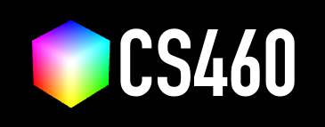

# CS460 Assignment 2: Kinetic 3D Cube Art & Swarm Engine

An interactive, multi-dimensional WebGL cube art visualization built with the **XTK (The X Toolkit)** framework.

---

## Visual Architecture & Features

### 1. The Sculpture: "Cyber Phoenix Guardian"
- **Tiered Crystal Pedestal**: Multi-tier octagonal foundation ($y \in [-130, -76]$) with corner energy pylons and neon edge conduits.
- **Armored Torso & Beating Reactor Core**: Hollowed chest cavity housing a luminescent reactor core that pulses in real time.
- **Swept Cyber Wings**: Symmetrical multi-tiered voxel wing feathers spanning out into 3D space with stepped elevation and depth.
- **Head & Cyber Visor**: Armored helm featuring glowing dual-channel visor eyes that periodically scan and blink.
- **Dual Gyroscopic Satellite Rings**:
  - *Ring Alpha (Equatorial)*: 24 cubes revolving smoothly in an inclined orbit.
  - *Ring Beta (Polar)*: 28 cubes revolving in the counter-direction along an orthogonal plane.

### 2. Autonomous Cosmic Swarm ("Flying Cubes")
- 50+ free-flying kinetic cubes navigating 3D space along inclined orbits and harmonic Lissajous trajectories.
- Continuous multi-axis tumbling rotation (`transform.rotateX/Y/Z`).
- **Interactive Burst**: Pressing `[F]`, clicking **Launch Swarm**, or `Shift + Clicking` anywhere on canvas fires high-speed particle bursts outwards from the core.

### 3. Dynamic Animations
- **Explosion & Assembly**: Pressing `[Space]` or clicking **Explode** sends all cubes flying outwards along radial trajectories, with smooth spring-lerp snapping back into place upon reassembly.
- **3D Ocean Wave Ripple**: Real-time sine wave propagation radiating through the voxel platform ($y = y_{\text{base}} + \sin(\text{dist} \cdot 0.035 - 4t) \cdot 14$).
- **Anti-Gravity Breathing**: Gentle harmonic hover motion applied to the entire construct.
- **Cinematic Auto-Camera Orbit**: Smooth continuous 360-degree orbital camera rotation around the art centerpiece.

### 4. Color Engines & Themes
- **Cyberpunk Neon**: Electric cyan, hot magenta, ultraviolet, and cyber gold.
- **Solar Flare (Magma)**: White-hot core, incandescent amber, flame orange, and volcanic crimson.
- **Matrix Glitch**: Acid green, toxic lime, deep binary jade, and digital white.
- **Vaporwave Dream**: Pastel teal, bubblegum pink, lavender purple, and coral peach.
- **Rainbow Prism**: Dynamic procedural HSV gradient wave continuously flowing across 3D coordinates and time.

### 5. Web Audio API Sound FX
- Synthesizer generated sound feedback for explosions, assembly crystallization, warp bursts, and harmonic palette shifts.

---

## Controls

| Action | Control |
| :--- | :--- |
| **Explode / Assemble** | `Space` or HUD Button |
| **Wave Dance (Ripple)** | `W` or HUD Button |
| **Launch Swarm Burst** | `F`, HUD Button, or `Shift + Click` |
| **Cycle Color Theme** | `C` or HUD Swatches |
| **Direct Palette Select**| `1` (Cyber), `2` (Magma), `3` (Matrix), `4` (Vapor), `5` (Prism) |
| **Auto-Camera Orbit** | `R` or HUD Button |
| **Toggle Sound FX** | `M` or HUD Button |
| **Orbit View** | Left-Click + Drag (XTK Trackball) |
| **Pan View** | Right-Click + Drag |
| **Zoom In / Out** | Mouse Wheel / Middle-Click Drag |
